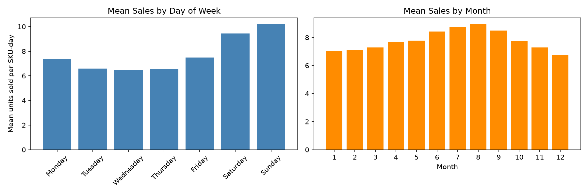
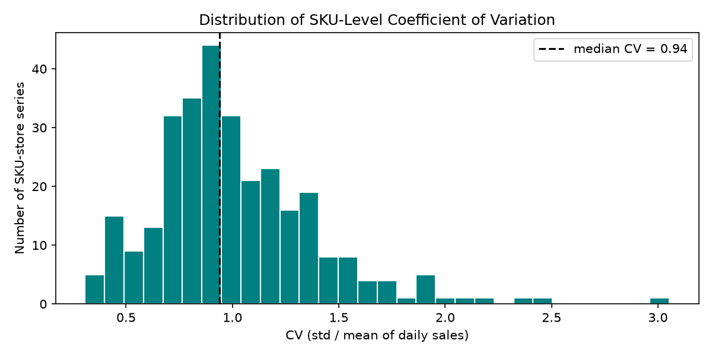
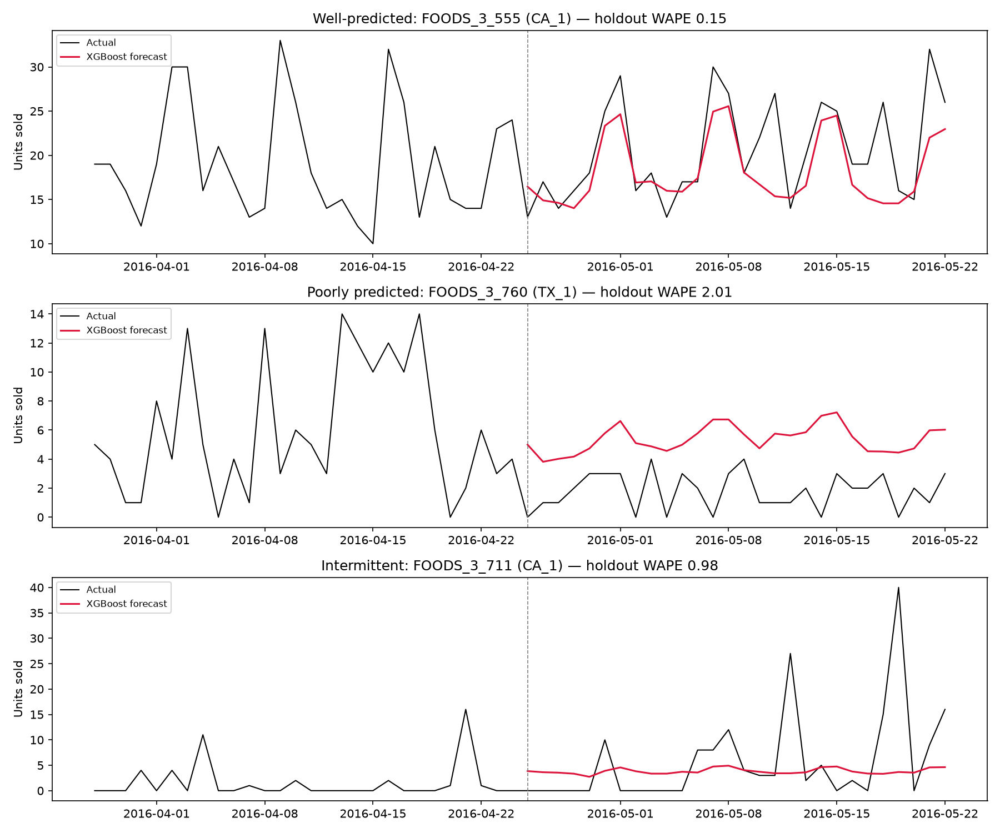

# Demand Forecasting — Retail (M5 / Walmart)

End-to-end demand forecasting pipeline built on the M5 (Walmart) dataset: data prep, EDA, baseline models, XGBoost with a light hyperparameter search, Prophet, and an error analysis that translates forecast residuals into safety-stock recommendations.

## Problem Statement

> A regional retailer's demand planning team places weekly purchase orders for hundreds of SKUs across multiple stores. Forecast errors are costly in both directions: under-forecasting causes stockouts and lost sales, while over-forecasting ties up capital in excess inventory and increases holding costs.
>
> This project builds an end-to-end demand forecasting pipeline on the M5 (Walmart) dataset to support weekly replenishment decisions. Beyond forecast accuracy, the goal is decision quality: forecasts are evaluated against naive and seasonal baselines (RMSE, MAE, WAPE), errors are analyzed by SKU demand segment, and residual uncertainty is translated into safety-stock recommendations under different service-level targets (95% vs. 99%).

## Scope

> To keep the analysis focused and interpretable, this project uses a subset of the M5 dataset: the top 150 SKUs (by total unit sales) in the FOODS_3 category across two stores (CA_1 and TX_1), covering roughly three years of daily sales (2013–2016) — about 371,400 store-item-day observations. This subset preserves the key challenges of retail demand forecasting — strong day-of-week and holiday seasonality, promotional price changes, and a mix of fast-moving and intermittent SKUs — while remaining small enough to iterate quickly. Price data comes from `sell_prices.csv` and calendar/event features (holidays, SNAP days) from `calendar.csv`.

## Data

Raw M5 files (not committed — see [Reproduce](#reproduce)):

| File | Contents |
|---|---|
| `sales_train_evaluation.csv` | Daily unit sales, wide format (one row per store-item, one column per day) |
| `calendar.csv` | Date, weekday, month, event names/types, SNAP flags per state |
| `sell_prices.csv` | Weekly sell price per store-item |

`src/data_prep.py` filters to scope, melts sales into a tidy `date | store_id | item_id | sales` long table, and joins in calendar and price features (forward/back-filled to daily), producing `data/processed/modeling_table.parquet` — 371,400 rows, 2013-01-01 to 2016-05-22, zero missing dates across all 300 store-item series.

## Key EDA Findings

Full analysis in [`notebooks/01_eda.ipynb`](notebooks/01_eda.ipynb).

- **Weekly seasonality dominates**: Sunday sales average 10.2 units/SKU-day vs. 6.5 on Wednesday (~58% swing) — day-of-week is the strongest calendar signal.
- **Event effects are type-specific, not uniform**: the aggregate event-vs-non-event gap is flat, but Cultural/Sporting events lift sales (~8.3–8.5) while National holidays suppress them (~7.2) — a blanket "is_event" flag would wash out real, offsetting effects.
- **Demand is genuinely intermittent**: 54% of SKU-store series have >20% zero-sales days (mean 23%), which is why WAPE — not MAPE — is the primary metric.
- **SKU volatility spans a 10x range** (CV from 0.31 to 3.05, median 0.94). SKUs are split into stable (CV < median) and volatile (CV ≥ median) segments, reused throughout evaluation.
- **Price elasticity exists but is SKU-specific**: some SKUs show a clear ~3 unit/day drop after a price increase, others barely react.

<p align="center">
  
</p>

<p align="center">
  
</p>

## Modeling Approach & Validation

**Metrics**: RMSE, MAE, and **WAPE** (primary) — WAPE (`sum(|error|) / sum(|actual|)`) is scale-aware and stays well-defined on zero-sales days, unlike MAPE, which is critical given the intermittency found in EDA.

**Validation**: strictly time-based, never random splits. The **final 28 days** of data are held out as the test set, untouched until final evaluation. For XGBoost hyperparameter selection, **rolling-origin (walk-forward) cross-validation** is used: 3 folds, each a 28-day horizon immediately preceding the previous one, walking backward from the final holdout — this respects the time-series structure and avoids ever training on data from a fold's own future.

**Models**:
1. **Baselines** (`src/models.py`): naive (same weekday last week), 28-day moving average, seasonal naive (t-364, falling back to t-28 for short histories).
2. **XGBoost** (`src/features.py`): lags (7/14/28), rolling mean/std (7/28, computed on prior-day sales to avoid leakage), day-of-week, month, event flag, SNAP, price, price-change flag, and label-encoded store/item id. Forecasts the 28-day holdout recursively — each day's lag features are built from actual history plus the model's own prior predictions. Hyperparameters (`max_depth`, `learning_rate`, `n_estimators`) tuned via the rolling-origin CV described above (12 combos).
3. **Prophet**: per-SKU models (weekly + yearly seasonality) fit independently on the 10 highest-volume series, as a comparison point — full details in [`notebooks/02_modeling.ipynb`](notebooks/02_modeling.ipynb).

## Results

Evaluated on the 28-day holdout (2016-04-25 to 2016-05-22), pooled across all 300 store-item series (not averaged per-series, which would overweight low-volume SKUs):

| Model | Segment | RMSE | MAE | WAPE |
|---|---|---:|---:|---:|
| Naive (t-7) | overall | 6.916 | 4.169 | 0.532 |
| 28-day Moving Average | overall | 6.085 | 3.705 | **0.473** |
| Seasonal Naive (t-364) | overall | 8.914 | 5.400 | 0.689 |
| **XGBoost** | **overall** | **5.465** | **3.429** | **0.437** |
| XGBoost | stable | 5.771 | 3.843 | 0.354 |
| XGBoost | volatile | 5.141 | 3.016 | 0.626 |

The **28-day moving average is the strongest baseline** — it beat both the weekly naive and the yearly seasonal naive, because FOODS_3 demand here is driven far more by weekly cadence than by year-over-year seasonality. **XGBoost beats it by ~7.6% relative WAPE** (0.437 vs. 0.473), and the improvement holds in both the stable and volatile segments, not just the easier half.

On the top-10 highest-volume SKUs, Prophet (WAPE 0.244) beats the moving-average baseline (0.279) but not XGBoost (0.220) — Prophet's per-SKU seasonal decomposition helps over a naive baseline, but it can't share cross-SKU signal (price, SNAP, events) the way one XGBoost model trained across all 300 series can.

<p align="center">
  
</p>

## Business Recommendations

Full error analysis in [`notebooks/03_evaluation.ipynb`](notebooks/03_evaluation.ipynb).

**Where XGBoost fails**: SKU segment is the dominant error driver — volatile-segment WAPE (0.626) is ~1.8x stable-segment WAPE (0.354) — while event days and store location have little effect (event days are actually forecast *slightly* better, likely because SNAP/event features give the model useful signal exactly when it needs it).

**Safety stock** (`SS = z × σ_error × √lead_time`, 7-day lead time, using holdout residual std per SKU): moving from 95% to 99% service level increases total safety stock by a uniform 41% (a mechanical consequence of the z-score ratio). More notably, **stable-segment SKUs carry more total absolute safety stock (2,890 units) than volatile SKUs (2,218 units)** at 95% service level, despite having much lower relative error — because they sell ~2.3x more volume on average, so their absolute forecast error, and therefore absolute safety stock, stays larger in raw units. Relative accuracy (WAPE) and absolute inventory risk (safety-stock units) are different questions.

1. **Deploy XGBoost as the primary forecasting model**, replacing the moving-average baseline. Keep the 28-day moving average as a fallback for SKUs the model can't score (e.g. brand-new items with no lag history).
2. **Route volatile-segment SKUs to manual planner review**, not full automation — these are disproportionately low-volume, intermittent items where the model has little signal to work with.
3. **Set service levels by segment, not uniformly**: a 99% target for high-volume stable SKUs is a meaningfully bigger inventory commitment than the same target for volatile SKUs.
4. **Evaluate intermittent SKUs on rolling/weekly totals, not day-by-day accuracy** — a correct expected-value forecast on a zero-heavy series will look "wrong" on almost any single day by construction.

## Limitations & Next Steps

- **No real promotional data.** `price_change_flag` is inferred from week-over-week price deltas, not actual promo calendar data — a true promo flag would likely improve price-sensitive SKUs.
- **Two stores, one category.** CA_1 and TX_1 in FOODS_3 only; results may not generalize to other categories (e.g. HOBBIES, HOUSEHOLD) or store formats without re-validation.
- **No live pipeline.** This is a batch, one-shot analysis — a production system would need scheduled retraining, drift monitoring, and a feedback loop from actual vs. forecast to catch degradation.
- **Recursive forecasting compounds error.** XGBoost's 28-day forecast is generated day-by-day using its own prior predictions as lag inputs; a direct multi-horizon model (or per-horizon models) could reduce error accumulation over the back half of the forecast window.
- **Prophet was only run on 10 SKUs** for runtime reasons; a fuller per-SKU Prophet sweep across all 300 series was out of scope here but could reveal it's competitive on a wider set of stable, high-volume items.

## Reproduce

```bash
git clone <this-repo>
cd demand-forecasting-retail

python3.13 -m venv .venv
source .venv/bin/activate
pip install -r requirements.txt

# macOS only: XGBoost needs the OpenMP runtime
brew install libomp

# Place the raw M5 files in data/raw/:
#   calendar.csv, sales_train_evaluation.csv, sell_prices.csv
# (download from https://www.kaggle.com/competitions/m5-forecasting-accuracy)

python src/data_prep.py

jupyter nbconvert --to notebook --execute --inplace notebooks/01_eda.ipynb
jupyter nbconvert --to notebook --execute --inplace notebooks/02_modeling.ipynb
jupyter nbconvert --to notebook --execute --inplace notebooks/03_evaluation.ipynb
```

Total runtime: under 3 minutes on a 2023-era laptop (data prep ~5s, EDA notebook ~10s, modeling notebook ~80s including CV grid search and Prophet, evaluation notebook ~5s).

## Repo Structure

```
demand-forecasting-retail/
├── data/
│   ├── raw/          (gitignored — place M5 CSVs here)
│   └── processed/    (gitignored — generated by src/data_prep.py and the notebooks)
├── notebooks/
│   ├── 01_eda.ipynb
│   ├── 02_modeling.ipynb
│   └── 03_evaluation.ipynb
├── src/
│   ├── data_prep.py
│   ├── features.py
│   ├── models.py
│   └── metrics.py
├── figures/
├── requirements.txt
└── README.md
```

---

**Resume bullet:** Built an end-to-end demand forecasting pipeline (XGBoost, Prophet) on a 150-SKU retail dataset; reduced WAPE 7.6% vs. the best baseline (28-day moving average) and translated forecast errors into segment-specific safety-stock recommendations.
